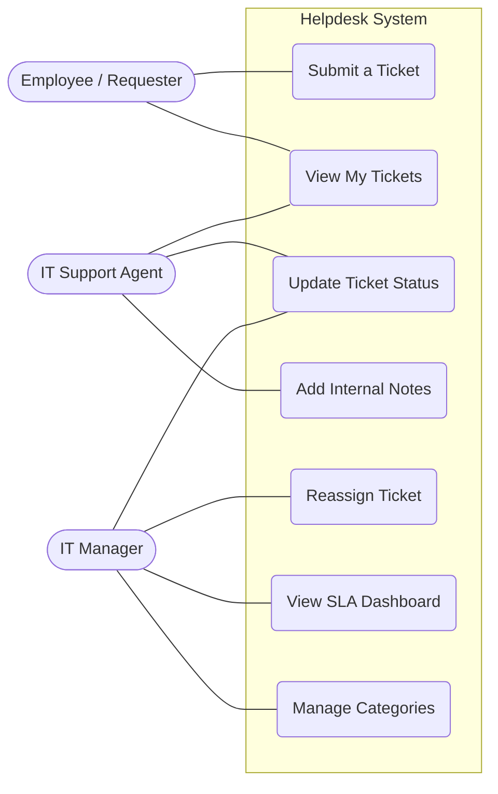
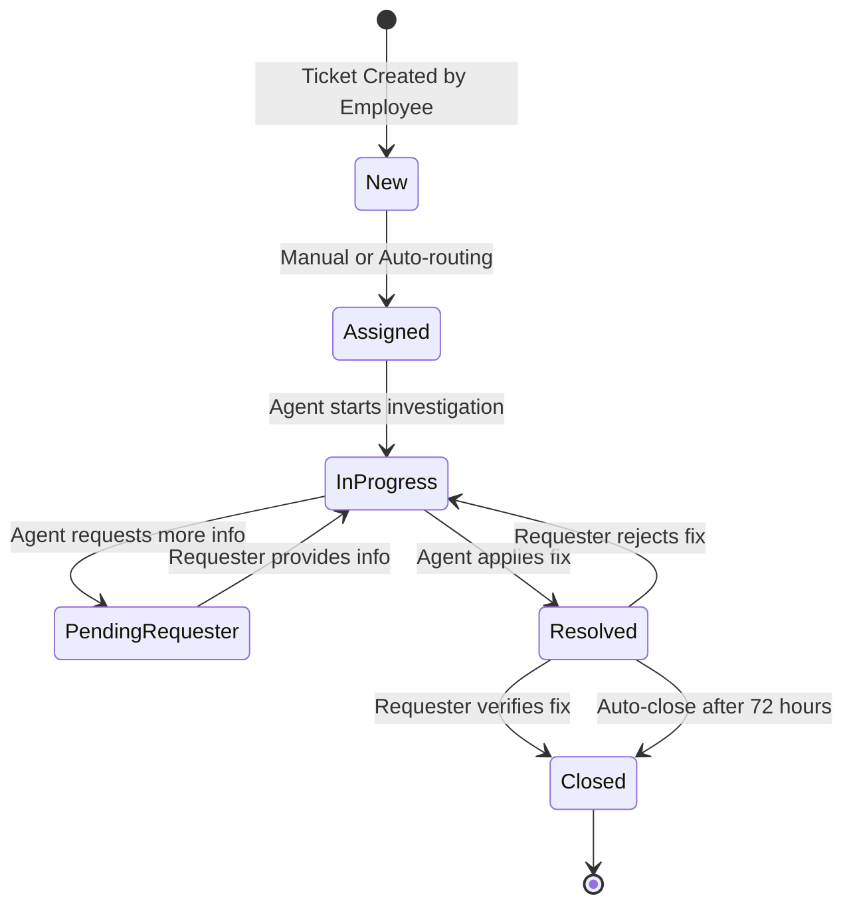
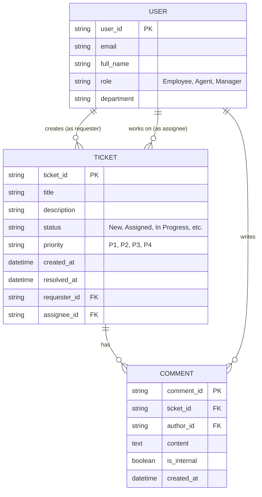

# System Architecture & Diagrams
**Project:** Internal IT Helpdesk Ticketing System  

This document visualizes the system's interactions and workflows using Mermaid.js. GitHub natively supports Mermaid, allowing these diagrams to be rendered directly from code.

## 1. Use Case Diagram
This diagram outlines the primary actors in the system and their respective interactions (Use Cases) with the Helpdesk application.

## 2. Ticket Status Workflow (State Diagram)
This state machine diagram illustrates the strict lifecycle a ticket follows from creation to closure. It reflects the business rules defined in the PRD.

## 3. Basic Entity-Relationship Diagram (ERD)
This diagram defines the foundational data structure required for the Phase 1 (MVP) release.

